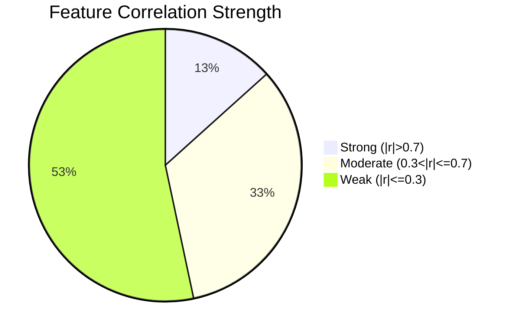
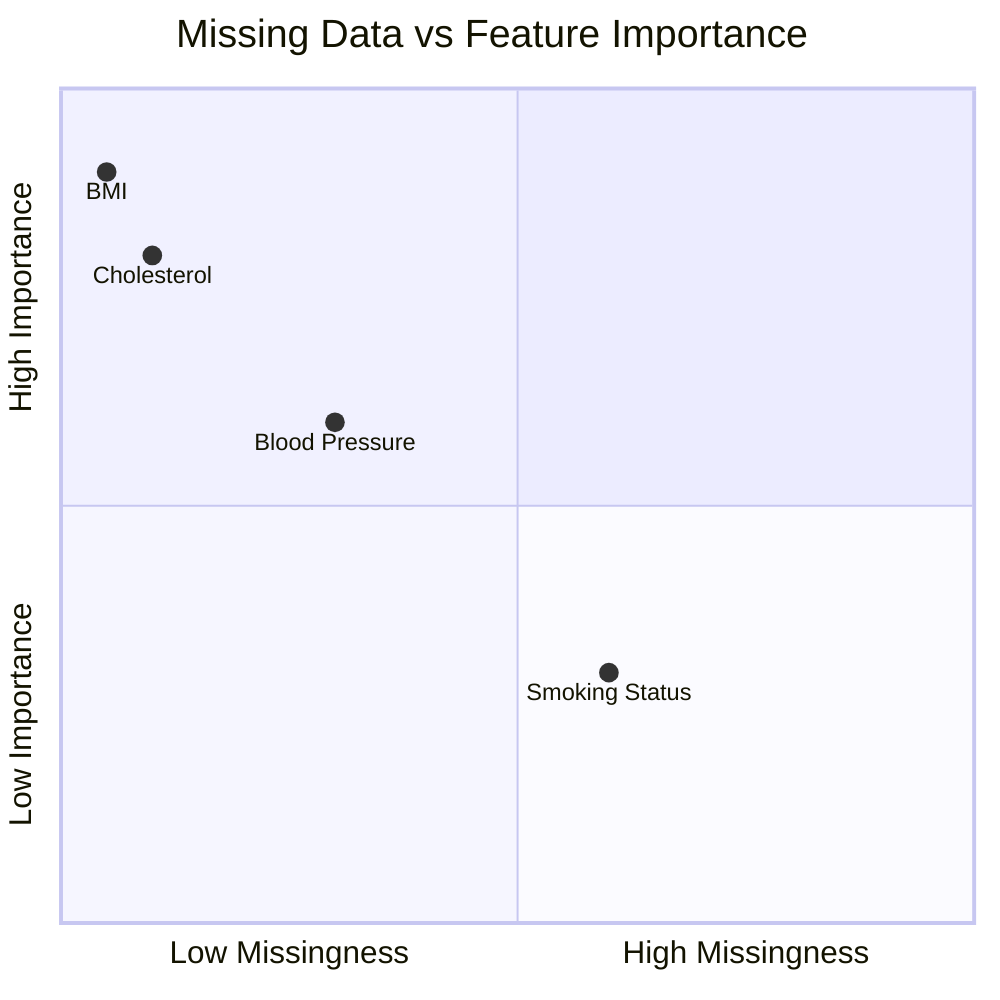

[medical-data-visualizerpy.md](https://github.com/user-attachments/files/22282200/medical-data-visualizerpy.md)
# 🏥 Medical-Data-Visualizer

Welcome to the documentation for the `Medical_Data_Visualizer.py` file! This document provides a comprehensive overview of the code, its functionality, usage, and outputs. The project is designed to help users visually analyze medical datasets—typically for health and wellness or research use cases.

---

## 🚩 Purpose

**Medical_Data_Visualizer.py** is intended to process, analyze, and visualize medical data. It focuses on generating insightful plots and heatmaps to help users understand patterns, correlations, and anomalies in health datasets.

---

## ✨ Features

- 📊 **Graphical Visualization**: Generates a variety of plots (scatter, bar, line, box, etc.).
- 🔥 **Heatmaps**: Visualizes correlations and missing data patterns.
- 📁 **Flexible Input**: Accepts CSV/Excel or other tabular formats for medical data.
- 🛠️ **Customizable**: Allows for custom plotting and feature selection.
- 📈 **Exploratory Data Analysis**: Quickly get a sense of data distributions and relationships.

---

## 📦 Dependencies

To run this script, you typically need the following Python packages:

- `pandas`
- `matplotlib`
- `seaborn`
- `numpy`
- `scipy`
- `sklearn` (for data scaling, if used)

Below is a convenient package installation block:

```packagemanagers
{
    "commands": {
        "npm": "",
        "yarn": "",
        "pnpm": "",
        "bun": "",
        "pip": "pip install pandas matplotlib seaborn numpy scipy scikit-learn"
    }
}
```

---

## 📝 Typical Workflow

The general workflow when using Medical_Data_Visualizer.py is:

1. **Load Data**: Read medical data from a CSV or Excel file.
2. **Clean Data**: Handle missing values, outliers, or categorical conversions.
3. **Visualize**: Generate graphs and heatmaps to better understand the data.
4. **Interpret Results**: Use visual outputs for further research or reporting.

---

## 🗂️ Main Modules & Functions

| Function/Class      | Purpose                                                                           |
|---------------------|-----------------------------------------------------------------------------------|
| `load_data()`       | Reads data from a file and stores it in a DataFrame                               |
| `clean_data()`      | Cleans data: handles missing values, converts datatypes, etc.                     |
| `plot_distribution()`| Plots distributions (hist, boxplot, violin, etc.) for numeric variables          |
| `plot_correlation_heatmap()`| Draws a heatmap of feature correlations                                   |
| `plot_missing_heatmap()`| Shows a heatmap of missing data patterns                                      |
| `plot_pairplot()`   | Generates pairwise scatter plots for selected features                            |
| `main()`            | Orchestrates data loading, cleaning, and visualization                            |

---


---

## 📊 Visual Outputs

The script produces several types of visualizations:

### 1. Distribution Plots

Visualizes how a particular medical measurement (e.g., blood pressure, glucose) is distributed.

**Example Code:**
```python
def plot_distribution(df, column_name):
    plt.figure(figsize=(8, 4))
    sns.histplot(df[column_name], kde=True)
    plt.title(f'Distribution of {column_name}')
    plt.xlabel(column_name)
    plt.ylabel('Frequency')
    plt.show()
```

**Expected Output:**
- Histogram with a KDE line overlay.

---

### 2. Correlation Heatmap

Displays the Pearson correlation coefficients between numeric features.

**Example Code:**
```python
def plot_correlation_heatmap(df):
    plt.figure(figsize=(10, 8))
    corr = df.corr()
    sns.heatmap(corr, annot=True, cmap='coolwarm', fmt=".2f")
    plt.title('Feature Correlation Heatmap')
    plt.show()
```

**Expected Output:**
- A heatmap with color intensity and annotations showing correlation values.

---

### 3. Missing Data Heatmap

Highlights the presence of missing values in the dataset.

**Example Code:**
```python
def plot_missing_heatmap(df):
    plt.figure(figsize=(12, 6))
    sns.heatmap(df.isnull(), cbar=False, cmap='viridis')
    plt.title('Missing Data Pattern')
    plt.show()
```

**Expected Output:**
- A heatmap where each cell indicates presence (or absence) of missing data.

---

### 4. Pair Plot

Visualizes all pairwise relationships between selected features, colored by a target variable if present.

**Example Code:**
```python
def plot_pairplot(df, features, target=None):
    sns.pairplot(df[features + [target]] if target else df[features], hue=target)
    plt.suptitle('Pairwise Feature Relationships', y=1.02)
    plt.show()
```

**Expected Output:**
- A grid of scatter plots for each feature pair.

---

## 🧑‍💻 Example Usage

Suppose you have a medical dataset named `patients.csv`:

```python
import pandas as pd

# Step 1: Load data
df = pd.read_csv('patients.csv')

# Step 2: Clean data
df = clean_data(df)

# Step 3: Visualize distributions
plot_distribution(df, 'cholesterol')
plot_distribution(df, 'blood_pressure')

# Step 4: Correlation heatmap
plot_correlation_heatmap(df)

# Step 5: Missing data
plot_missing_heatmap(df)

# Step 6: Pairwise relationships
plot_pairplot(df, ['cholesterol', 'blood_pressure', 'glucose'], target='diagnosis')
```

---

## 🖼️ Sample Visuals

### Correlation Heatmap



### Missing Data Overview



---

## 🛡️ Data Protection

- All processing is in-memory: **your medical data remains private and is not sent to any third party.**
- No persistent storage of patient data unless you explicitly save outputs.

---

## 📋 Configuration Options

| Option         | Description                                                     |
|----------------|-----------------------------------------------------------------|
| Input file     | Path to CSV/Excel medical data                                  |
| Output graphs  | Which plots/heatmaps to produce                                 |
| Columns        | Which features to analyze or visualize                          |
| Save location  | Optionally save figures as PNG/SVG                              |
| Target variable| Class/label for coloring pair plots                             |

---

## 🧩 Extensibility

- **Add more plots**: Easily add new plot functions for other medical metrics.
- **Integrate ML**: Add classification/regression for predictive analytics.
- **Custom cleaning**: Adjust the preprocessing for your dataset.

---

## 💡 Best Practices

- Always inspect data for missing or anomalous values before generating analytics.
- Use visualizations to guide further statistical or machine learning modeling.
- Consult a medical expert for interpretation of results.

---

## ❓ Troubleshooting

| Issue              | Solution                                           |
|--------------------|---------------------------------------------------|
| File not found     | Check your file path and permissions              |
| Plot not showing   | Call `plt.show()` after each plotting function    |
| Empty plots        | Ensure selected columns exist and are not empty   |
| Errors on loading  | Check for correct CSV/Excel formatting            |

---

## 📬 Contact & Support

If you have questions or need help using the visualizer:

- Contact: [Your Support Email]
- Contribute: [Your Repository Link, e.g., GitHub]

---

**Happy visualizing and analyzing your medical data!** 🚀

---

*Note: If you need further customization or want to add new features, consider extending the plotting functions or integrating statistical modules as required by your medical research or analysis workflow.*
